# UI
## List of Interface
1. Home Page  
    * If user not logged in  
        Button navigate to the _Popular User Page_  
        Button navigate to the _Login Page_  
        Button navigate to the _Sign-up Page_  
        Button navigate to the _Github Project Page_  
        Button navigate to the _Home Page_  
    * If user logged in  
        Button to logout   
        Button navigate to the _Popular User Page_  
        Button navigate to the _My Page_  
        Button navigate to the _Searching Page_  
        Button navigate to the _Edit Score Page_  
        Button navigate to the _Github Project Page_  
        Button navigate to the _Home Page_  
        ⭐If user is ADMIN: Button navigate to the _Management Page_
2. Login Page
    Button navigate to the _Home Page_  
    Inputbox for entering Username  
    Inputbox for entering Password  
    Checkbox for Remember Me  
    Hyperlink navigate to _Forget Password Page_  
    Button to Login  
3. Sign-up Page  
    Inputbox for entering Username  
    Inputbox for entering Password  
    Inputbox for entering First Name  
    Inputbox for entering Last Name  
    Inputbox for entering Age  
    Selectbox for selecting Sex  
    Inputbox for entering Age  
    Inputbox for entering Email  
    Inputbox for entering Phone Number  
    Button navigate to the _Home Page_  
    Button to Sign-up
4. My Page  
    Button navigate to the _Edit Information Page_  
    Button to logout  
    Button back to the last page  
    Button navigate to the _Home Page_  
    Button navigate to the _Github Project Page_  
5. Edit Information Page   
    Button back to the last page  
    Button to logout  
    Inputbox for entering Username  
    Inputbox for entering First Name  
    Inputbox for entering Last Name  
    Inputbox for entering Age  
    Selectbox for selecting Sex  
    Inputbox for entering Age  
    Inputbox for entering Email  
    Inputbox for entering Phone Number  
    Button to edit Basic Information  
    Inputbox for entering About Me  
    Inputbox for entering Something to Say  
    Button to edit Introduction Information     
    Button navigate to the _Home Page_  
    Button navigate to the _Github Project Page_   
6. Searching Page  
    Button back to the last page  
    Button to logout  
    Inputbox for entering Minimum Age  
    Inputbox for entering Maximum Age  
    Selectbox for selecting Sex  
    Button to searching  
    Button navigate to the _Home Page_  
    Button navigate to the _Github Project Page_   
7. Result Page  
    Button back to the last page  
    Button to logout  
    Button navigate to the result's _User Page_   
    Button navigate to the _Home Page_  
    Button navigate to the _Github Project Page_   
8. User Page  
    Button back to the last page  
    Button to logout  
    Button to like this user  
    Button to dislike this user  
    Button navigate to the _Home Page_  
    Button navigate to the _Github Project Page_  
9. Edit Score Page  
    Button back to the last page  
    Button to logout  
    Selectbox for selecting Sports Score from 1 to 10  
    Selectbox for selecting Music Score from 1 to 10  
    Selectbox for selecting Travel Score from 1 to 10  
    Selectbox for selecting Reading Score from 1 to 10  
    Selectbox for selecting Art Score from 1 to 10  
    Selectbox for selecting Movie Score from 1 to 10  
    Selectbox for selecting Cartoon Score from 1 to 10  
    Selectbox for selecting Games Score from 1 to 10  
    Selectbox for selecting Cooking Score from 1 to 10
    Selectbox for selecting Shopping Score from 1 to 10  
    Button to edit score  
    Button navigate to the _Home Page_  
    Button navigate to the _Github Project Page_  
10. Popular User Page  
    * If user not logged in  
        Button navigate to the _Login Page_  
        Button navigate to the _Sign-up Page_  
        Button navigate to the _Github Project Page_  
        Button navigate to the _Home Page_  
    * If user logged in  
        Button back to the last page  
        Button to logout  
        Button navigate to the _Github Project Page_  
        Button navigate to the _Home Page_  
11. Management Page  
    Button back to the last page  
    Button to logout   
    Inputbox for entering Username    
    Selectbox for selecting Role  
    Button to change Role  
    Button delete user  
    Button navigate to the _Github Project Page_  
    Button to create random users   
    Button navigate to the _Home Page_

## Interface Design
1. Home Page  
    * If user not logged in  
    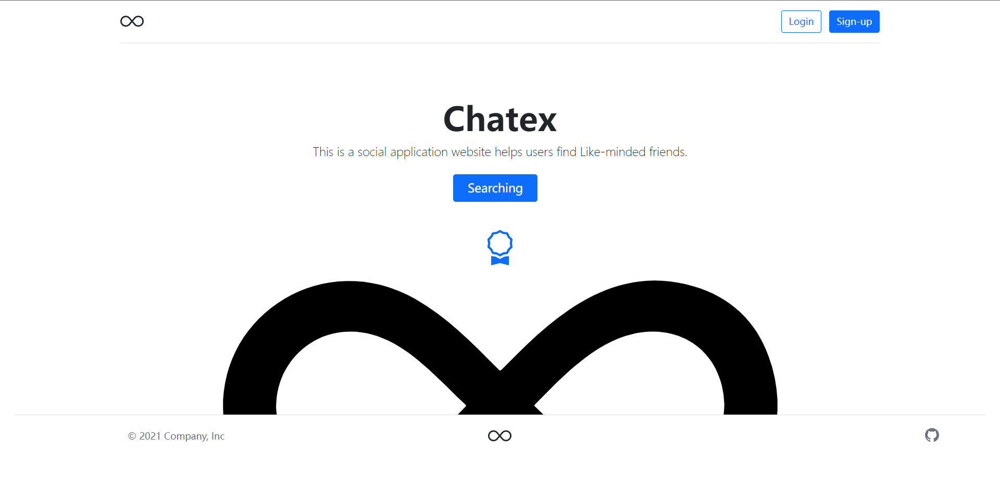  
    * If user logged in  
      
2. Login Page
    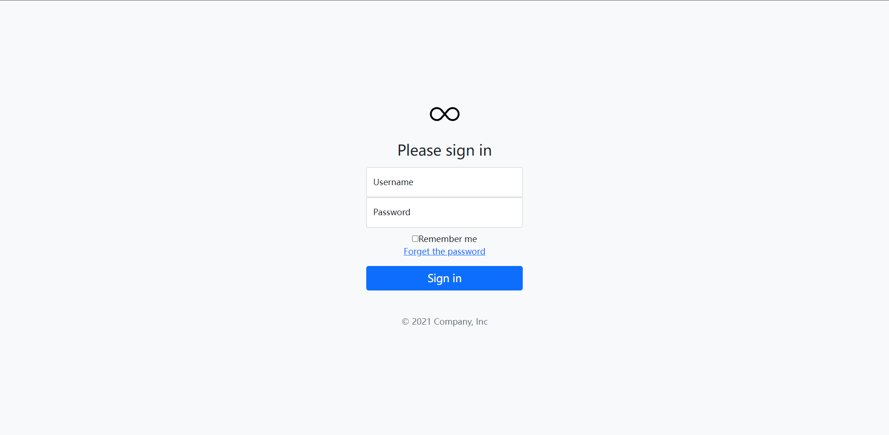 
3. Sign-up Page  
    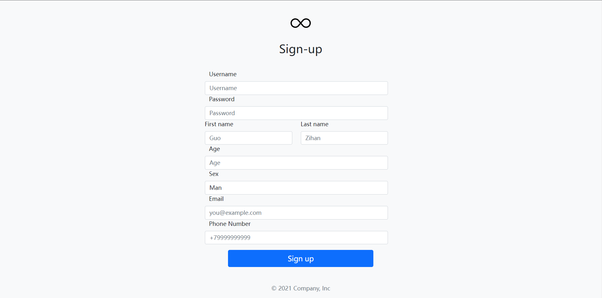 

4. My Page  
    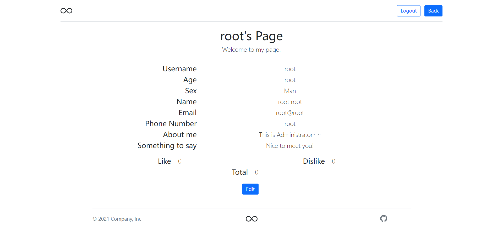 
5. Edit Information Page   
      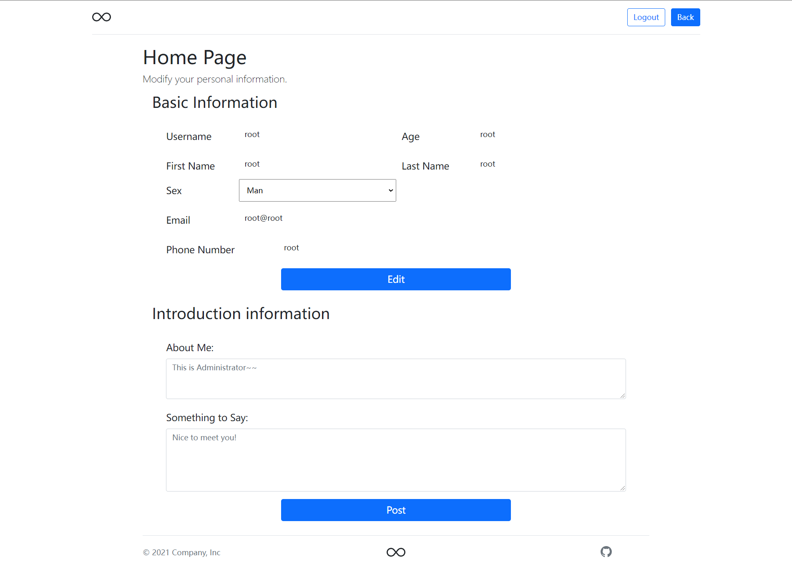   
6. Searching Page  
      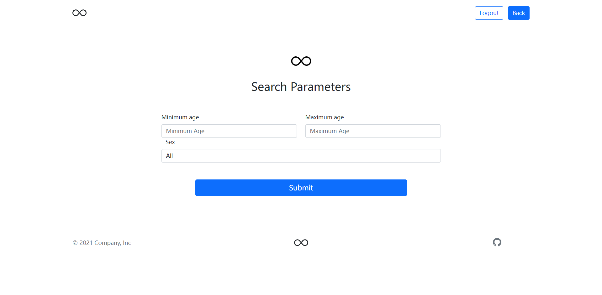   
7. Result Page  
    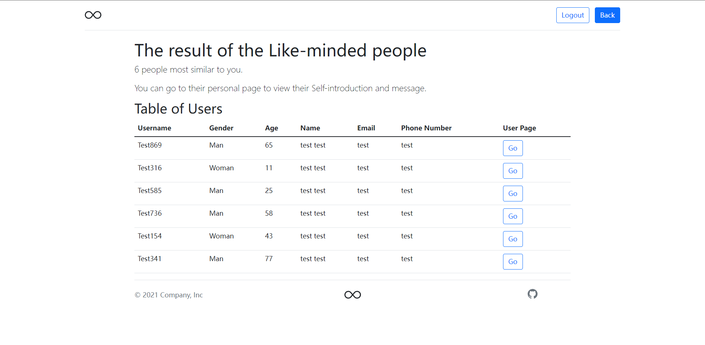     
8. User Page  
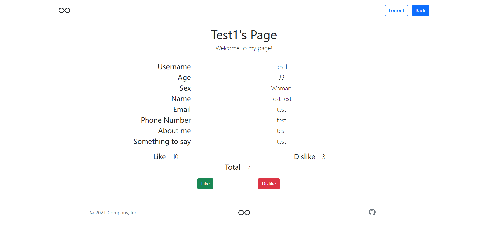
9. Edit Score Page  
  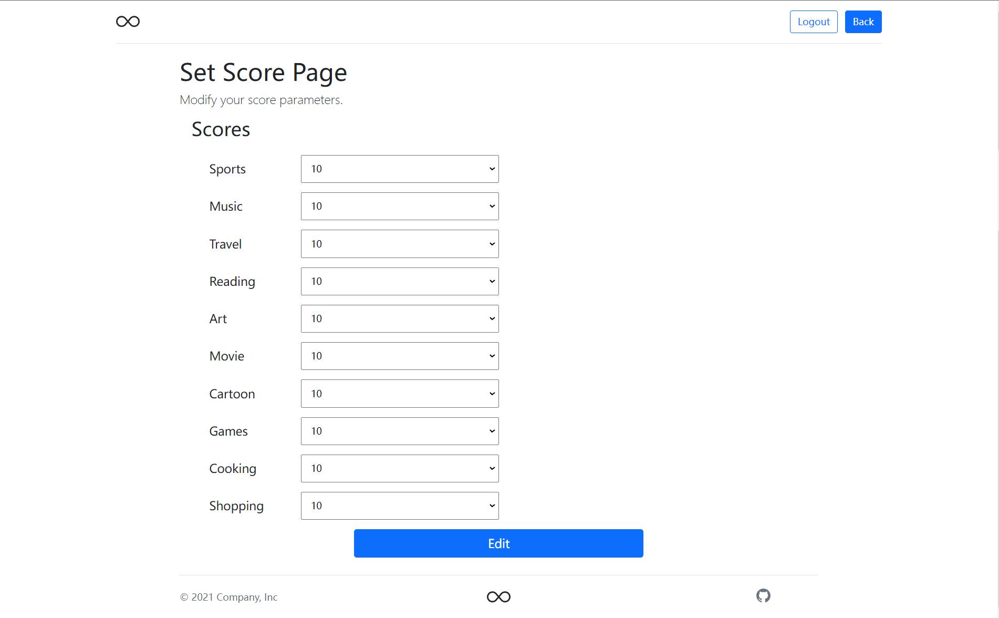
  
10. Popular User Page  
    * If user not logged in  
  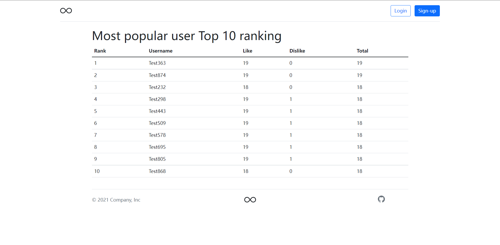

    * If user logged in  
   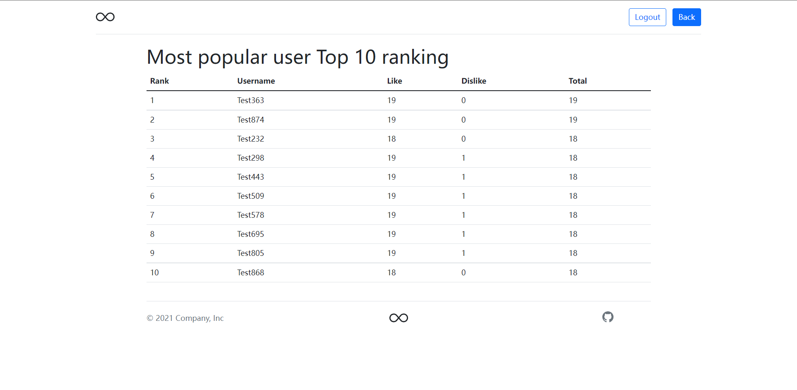

  11. Management Page  
 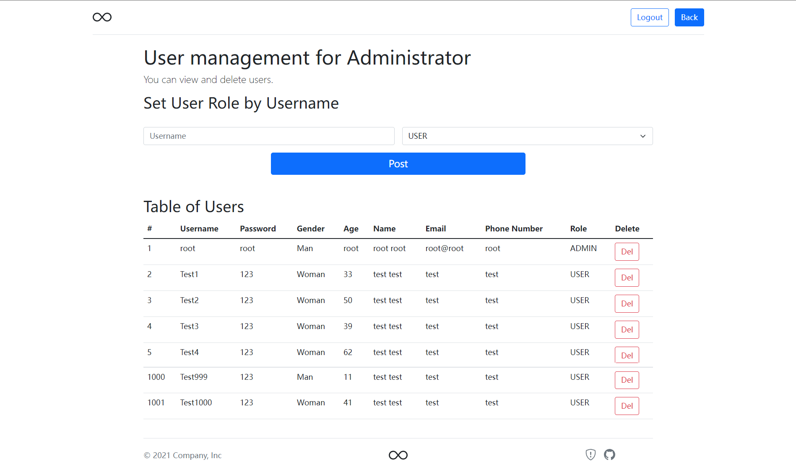

## Interface Diagram